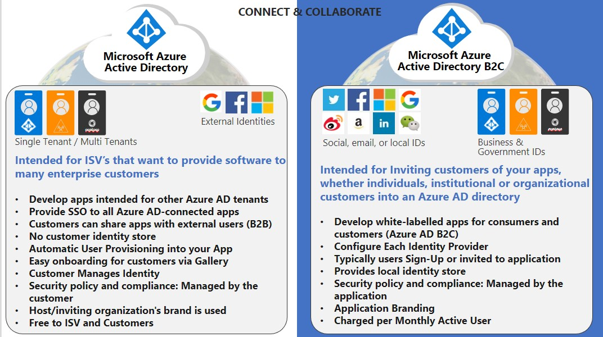
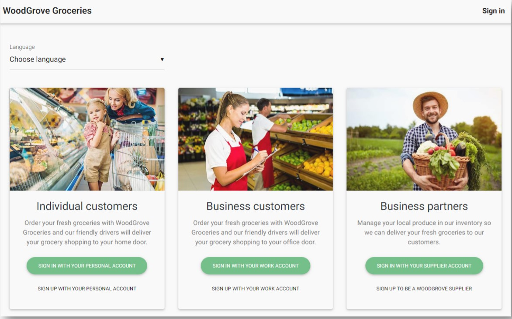

# A Primer on Microsoft External Identities 
A 300, *400-ish* level primer on the MS external identities...ideal for [ISVs](_ "=Independent Software Vendors")!

*Definition*: An **external identity** allows people [outside your org](_ "Examples: partners, distributors, suppliers, vendors, guests") to access your resources and apps, while letting them sign in with whatever they prefer.

In a nutshell... 
- Allows users to "bring your own identities"
- External IDPs to manage their own users identities while ISVs focus on access to their apps and protecting them.
- Less about user's relationship to an org, more about how a user wants to sign in an ISV apps.
 
 

- [x] [Next &#8595;](#3-types-of-external-identities)

## 3 Types of External Identities 

**Identity and Security solutions *from* Microsoft, *​not for* Microsoft​...** 

- Azure AD
- B2B (Business to Business)
- B2C (Business to Consumers)

***A break down...Which Identity Do I Use?***

#### 1. AAD = Enterprise
 Manages employee access to SaaS apps and resources with supported features such as licensing and Conditional access, e.g. RBAC for Azure. 
 - Develop apps intended for a single org (single tenant) or from any org/AAD Tenant (multi-tenant) 
 - Multi-tenant apps = no management of external identities and frictionless to implement
    
#### 2. B2B = Collaboration
Allows external users as "guests" to your tenant to share your tenant's apps and resources.
-  Full fledge accounts in your tenant, but guests allowed to use their existing credentials (authN)
-  2 flavors of the B2B authN - Federated and non-federated

Scenarios 
- A guest user that access your Power BI portal with read-write access to reports.
- A guest user to access your Office 365 apps, e.g. read access to sharepoint or co-author a word doc.

#### 3. B2C = Customers/Consumers/Citizens
IdAM platform for building web and mobile apps; build white-labelled apps! 
- High level of customizations of user identity flows, e.g. user sign up and in.
- Out of box integration with social IDPs.

 

- [ ] [Next &#8595;](#at-a-product-level)

## At a Product Level

  
 

- [ ] [Next &#8595;](#3-types-of-external-identities)

## Not an "OR" condition
